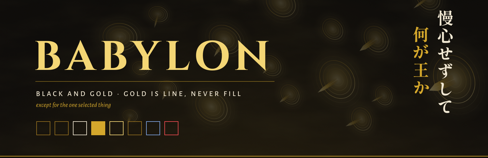

<p align="center"></p>

<p align="center"><sub>天地乖離す開闢の星<br>
慢心せずして何が王か</sub></p>

# ▼ BABYLON

Black and gold. **Gold is line, never fill**, with one exception that is the whole selection language: the one selected thing (the focused workspace, the current tmux window, the selected file, the current row, a task due today) is solid gold with black text. Crimson belongs to failure alone; lapis carries data. The forms are gates with blade tips, chains, cuneiform numerals and clay tablets.

## ▽ The treasury

| | | |
|---|---|---|
| **pitch** | `#0B0908` | the ground |
| **ivory** | `#F0E7D2` | text |
| **gold** | `#D4A72C` | every line; the one selection |
| **lit gold** | `#F4D675` | the time, the focus |
| **deep gold** | `#8E6B1F` | dim lines |
| **lapis** | `#7FA4E2` | data |
| **crimson** | `#EB4B50` | failure only |

## ▽ What is kept in it

- **Windows**: sharp; a lit gold → gold → deep gold border on the focused window
- **Waybar**: one black plane closed by a gold hairline, chains between modules,
  the time in Cinzel between two gates, cuneiform workspace numerals 1–10
- **mawaqit**: a gate in a gold line, open for the adhan, a blade through it for
  the iqama
- **yawm**: a solid gold block when due, crimson when overdue; ▼ ▽ ▶
- **hyprlock**: a Cinzel clock, three crimson drums beside the password, the saying
  in vertical Shippori Mincho B1; a wrong password answers 雑種
- **BabylonBlade** cursor, **Babylon** icons (black tablets with gold wedges, a gate
  for the trash), **GTK / Thunar**, **swaync**
- **Terminals**: JetBrains Mono 10.5, a gold block cursor; tmux with 王 on the
  session block
- **Type**: Cinzel, Shippori Mincho B1, Alegreya Sans, JetBrains Mono

## ▽ Tribute

- Arch Linux (the package check uses `pacman`)
- Hyprland 0.56 or newer: the configuration is written in Lua
- waybar 0.15 or newer
- the packages in `babylon/packages.txt`:

```sh
sudo pacman -S --needed $(grep -v '^#' babylon/packages.txt)
```

## ▼ Opening the gate

> [!WARNING]
> This is a whole desktop, not a colour scheme. It replaces every file listed
> in `babylon/MANIFEST`: the Hyprland, waybar, terminal, tmux, GTK and fontconfig
> configuration among them, and the theme line in `~/.zshrc`.
> Everything it replaces is backed up first.

```sh
git clone https://github.com/houssemMekhelbi/babylon.git
cd babylon
./babylon/restore.sh --dry-run   # show what would change, touch nothing
./babylon/restore.sh             # apply
```

`restore.sh` then:

1. reports missing packages;
2. backs up every path it is about to replace to `~/themes/.backups/before-babylon-<timestamp>/`;
3. copies the theme's `home/` over `$HOME` and removes the paths in its `ABSENT`;
4. points `~/.zshrc` at the theme's prompt;
5. applies its `gsettings.txt` and refreshes the font and icon caches;
6. builds the mawaqit-api image if it is missing, enables the user services and
   reloads Hyprland, waybar, hyprpaper, swaync and tmux.

`--files-only` copies the files and gsettings and leaves the services alone.

## ▽ Closing it

Copy the backup folder back over `$HOME`.

## ▽ Prayer times

Prayer times come from [mawaqit.net](https://mawaqit.net) through a local copy of
[mawaqit-api](https://github.com/mrsofiane/mawaqit-api), run by podman on 127.0.0.1.
List your mosques in `~/.config/mawaqit/mosques`, one `<mawaqit.net slug> | <label>`
per line; scroll or right-click the prayer module to switch between them.

## ▽ Other kingdoms

This is one of the hattin themes. They share one behaviour (binds, workspaces,
bar modules) and differ only in look. Clone several side by side and run the
`restore.sh` of the one you want: each switch removes what the previous theme
left that the new one does not use.

## ▽ Licence

MIT, see [LICENSE](LICENSE). The fonts in `<theme>/home/.local/share/fonts/` are
under the SIL Open Font License; each licence text sits next to its font.
mawaqit-api (`<theme>/home/.local/share/mawaqit-api/`) is MIT, © Sofiane Louchene.
